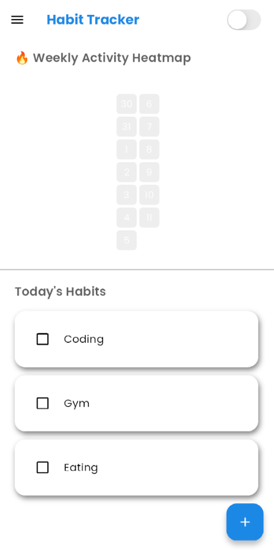
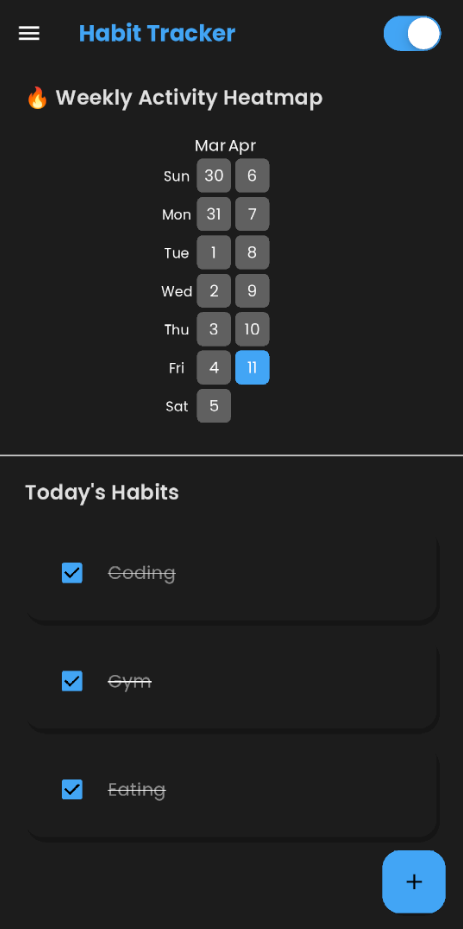

Absolutely! Here's a polished and **comprehensive `README.md`** for your Flutter Habit Tracker project, designed to impress both recruiters and contributors:

---

```markdown
# 🌱 Habit Tracker App

A beautiful and minimalistic Flutter app that helps you track your daily habits and visualize your progress over time. Built with offline-first architecture using [Isar Database](https://isar.dev/) and supports light/dark themes for better accessibility and aesthetics.

---

## ✨ Features

- ✅ Track daily habits with intuitive checkboxes
- ➕ Add, edit, or delete habits easily
- 📅 Visualize your weekly progress via heatmaps
- 🎨 Modern UI with [Google Fonts](https://fonts.google.com/)
- 🌓 Dark mode and light mode toggle
- 🔒 Offline-first using Isar local NoSQL database
- 📁 Modular and scalable architecture

---

## 📸 Screenshots

| Home Page (Light Mode) | Dark Mode |
|------------------------|-----------|
|  |  |

---

## 📦 Tech Stack

- **Flutter** – Frontend framework
- **Dart** – Core programming language
- **Isar** – Local NoSQL database
- **Provider** – State management
- **Lottie** – Animated weather components (optional)
- **Google Fonts** – Custom typography
- **Cupertino Switch** – iOS-style theme toggle

---

## 🧠 Project Structure

```
habit_tracker/
├── components/         # Reusable UI widgets (e.g., HabitTile, Heatmap)
├── database/           # Isar models and database logic
├── pages/              # Main screens (e.g., HomePage)
├── theme/              # Light and Dark themes
├── main.dart           # App entry point
└── pubspec.yaml        # Dependencies and assets
```

---

## 🚀 Getting Started

### 1. Clone the repo

```bash
git clone https://github.com/DannyMikeGanzaRwabuhama/habit_tracker_flutter.git
cd habit_tracker_flutter
```

### 2. Install dependencies

```bash
flutter pub get
```

### 3. Generate Isar bindings

```bash
flutter pub run build_runner build
```

### 4. Run the app

```bash
flutter run
```

> ✅ You can run on an emulator or real device (Android/iOS)

---

## ⚙️ Dependencies

```yaml
dependencies:
  flutter:
    sdk: flutter
    cupertino_icons: ^1.0.8
  provider: ^6.1.4
  isar: ^3.1.0+1
  isar_flutter_libs: ^3.1.0+1
  path_provider: ^2.1.5
  flutter_slidable: ^4.0.0
  flutter_heatmap_calendar: ^1.0.5
  lottie: ^3.3.1
  google_fonts: ^6.2.1
```

---

## 🛠️ Future Improvements

- 🧠 Habit reminder notifications
- 📆 Calendar view for custom date tracking
- 📊 Analytics screen for habit streaks
- ☁️ Cloud sync using Firebase or Supabase
- 🔐 Authentication with email/OAuth

---

## 🤝 Contributing

1. Fork this repository
2. Create a new branch: `git checkout -b feature/yourFeature`
3. Make your changes and commit: `git commit -m 'Add your feature'`
4. Push to the branch: `git push origin feature/yourFeature`
5. Create a pull request

---

## 🧑‍💻 Author

**Your Name**  
💼 [LinkedIn](https://www.linkedin.com/in/ganza-rwabuhama-danny-mike/)  
🐙 [GitHub](https://github.com/DannyMikeGanzaRwabuhama)

---

## 📄 License

This project is licensed under the [MIT License](LICENSE).

---
```